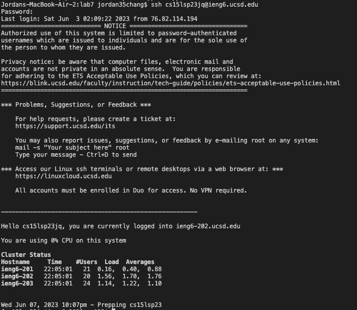
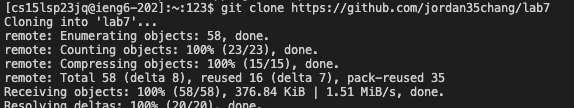
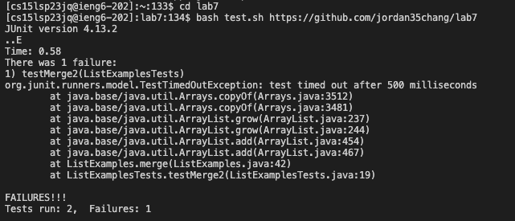
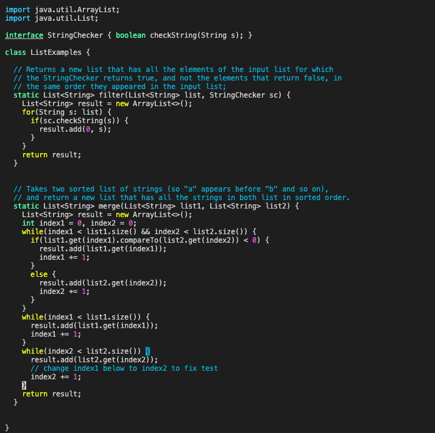
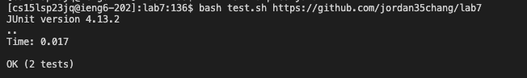
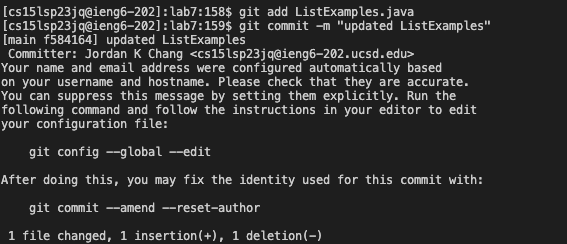
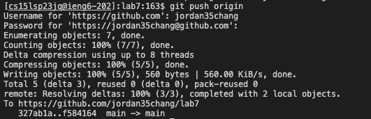
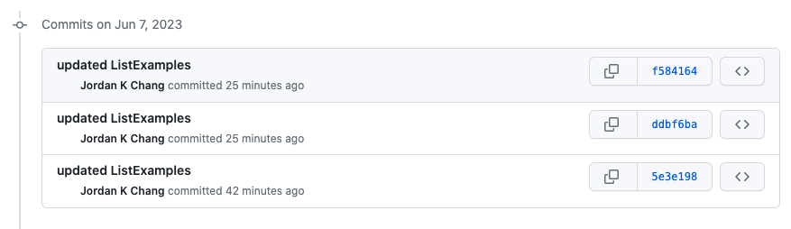

# Step 4:
   
## Keys Pressed:
```
<up><enter>
```   
## Summary:
The command for logging into ieng6 was 1 up in the search history, so used to up arrow to access.   
# Step 5:
   
## Keys Pressed:
```
 git clone https://github.com/jordan35chang/lab7<enter>
```   
## Summary:
Typed out the command to clone repositories from github, and then hit enter to exectue the command.   
# Step 6:
   
## Keys Pressed:
```
cd lab7<enter>
javac ListExamplesTests.java<enter>
```   
## Summary:
Used the cd command to change the directory to the lab7 directory. Then input the command to run the test.sh file, which then produced errors.   
# Step 7:
   
## Keys Pressed:
```
vim ListExamples.java<enter>
jjjjjjjjjjjjjjjjjjjjjjjjjjjjjjjjjjjjjjjjjjjlllllldwi index2<space><esc>:wq<enter>
```   
## Summary:
The vim command opens up the file to edit, and the j moves the cursor down to the line of error, while l moves the cursor to the right to change index1 to index2. Pressing dw deletes the word the cursor is on, so in this case index1, and hitting i allows you to insert 'index2 '. The esc exits the insert command, and :wq saves and exits the file. 
# Step 8:
    
## Keys Pressed:
```
<up><up><enter>
```   
## Summary:
The command to run the tests were two up in the search history, so used up arrow to access and enter to run the command.
# Step 9:
   
   
   
## Keys Pressed:
```
git add ListExamples.java<enter>
git commit -m "updated ListExamples"<enter>
git push origin<enter>
```   
## Summary:
The git add command specifies which file will be committed, while the commit command will actually commit the changes. The push command updates the repository after inputting username and password.
